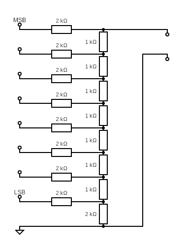
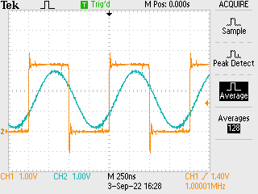
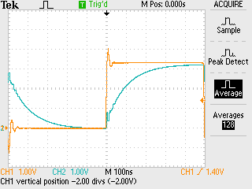
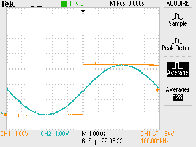

# Raspberry Pi Pico 8-bit signal generator

Deterministic time signal generator - 8 bit output at up to 125 MHz into a resistor DAC to give an analogue signal updated at 125 MHz. Notes:

- 125 MHz is derived from the PIO clock speed so can be slowed down easily.
- 125 MHz updates have to be near to one another as in my case the capacitance of the circuit was non-trivial.

## Wiring



The physical wiring simply requires a number of resistors at pretty good tolerance: the accuracy of the DAC is determined in part by the [tolerance of the resistors](https://en.wikipedia.org/wiki/Resistor_ladder). As in diagram I chose to use 1kΩ to limit the current from the GPIO pins to ~ mA. In reality the GPIO voltages for low and high are relatively "noisy" so the precision you will get with this DAC is pretty limited.

## Code

Driving GPIO pins from the PIO is a trivial exercise: the PIO assembly code is a "one liner" as:

```
.program eightbit

.wrap_target
    out pins 8
.wrap
```

This simply pushes 8 bits every PIO clock tick - the work is in the set-up:

```C
void eightbit_program_init(PIO pio, uint sm, uint offset, uint pin) {
    pio_sm_config c = eightbit_program_get_default_config(offset);

    // initialise 8 GPIO pins as output
    for (int off = 0; off < 8; off++) {
        pio_gpio_init(pio, pin + off);
        gpio_set_drive_strength(pin + off, GPIO_DRIVE_STRENGTH_2MA);
        gpio_set_slew_rate(pin + off, GPIO_SLEW_RATE_SLOW);
    }
    pio_sm_set_consecutive_pindirs(pio, sm, pin, 8, true);
    sm_config_set_out_pins(&c, pin, 8);

    // join TX and RX FIFO to double TX FIFO
    sm_config_set_fifo_join(&c, PIO_FIFO_JOIN_TX);

    // leave clock as-is - for 100 MHz operation etc. can adjust
    sm_config_set_clkdiv_int_frac(&c, 1, 0);

    // configure auto-pull etc.
    sm_config_set_out_shift(&c, true, true, 32);

    pio_sm_init(pio, sm, offset, &c);
}
```

Essentially assigning `pin` to `pin+7` GPIO to be out (from LSB to MSB; wire as above) with some additional settings for the output current (lower than default, minimal number of amplifier stages involved which helps reduce noise) and lowered the slew rate, which reduced the "overshoot" on transitioning from low to high and vice versa, again reducing the noise, with:

```C
        gpio_set_drive_strength(pin + off, GPIO_DRIVE_STRENGTH_2MA);
        gpio_set_slew_rate(pin + off, GPIO_SLEW_RATE_SLOW);
```

I also joined the RX FIFO onto the TX FIFO, but not sure how useful this is, and enabled auto-pull. The work here is keeping the TX FIFO fed. For this I used two DMA channels in a tick / tock configuration reading from the same 100kB buffer. For a 1MHz output signal with the default configuration as above you have 125 points for each cycle - thus copied a number of times to reduce the number of DMA transfer configuration steps needed. In this case it was set up with

```C
  for (int j = 0; j < 125; j++) {
    data[j] = 127 + 128 * sin(2 * M_PI * j / 125.);
  }

  for (int j = 1; j < (SIZE / 125); j++) {
    memcpy(data + 125 * j, data, 125);
  }
```

Where assignment followed by copying was chosen to avoid errors in `sin(t)` calculations for large values of `t` (though this was probably fine).

## Evaluation

Driving the DAC with a sine wave, and watching the MSB GPIO output (which should therefore be high for half of the cycle) shows that there is some signal attenuation:



Simply driving the program with a square wave (`0x00` / `0xFF` output) at 1MHz shows clear attenuation:



Fitting of this curve in `gnuplot` identified that there is capacitance in the circuit such that `RC=1e-7` or so, indicating that the stray capacitance is around 100pF. In practical terms this attenuates the output significantly at around 1MHz but seems to cause very little problem an order of magnitude slower than this.

Slowing to 100 kHz and making the adjustments above to the slew rate and current gave a much improved result:


